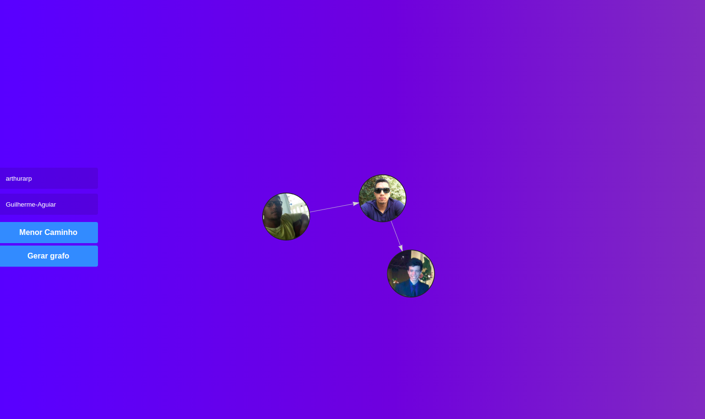

# Busca Git

**Número da Lista**: 1
**Conteúdo da Disciplina**: Grafos 1 

## Alunos

| Matrícula  | Aluno           |
| ---------- | --------------- |
| 16/0111978 | André Eduardo   |
| 16/0112974  | Arthur Rodrigues |

## Sobre

É uma adaptação baseada na [teoria dos seis graus de separação](https://pt.wikipedia.org/wiki/Teoria_dos_seis_graus_de_separa%C3%A7%C3%A3o) ou número de Kevin Bacon, no qual um usuário poderá saber a quantas camadas de distância (laços de amizade) ele está de algum outro usuário, dentro do universo do GitHub. Como o Github limita as requisições, o Caminhos_Git (Este projeto) será limitado à duas camadas a partir do nó inicial, ou seja, os amigos dos amigos do nó inicial. Nesse projeto consideramos "amigos" de um nó, todos os seguidores desse nó no GitHub.

## Vídeo

O vídeo está localizado na pasta video que fica na raiz do projeto.

## Screenshots

**Tela Login:**

**Tela inicial:**

**Tela inicial depois de apertar em Gerar grafo:**

**Tela inicial depois de clicar em Menor Caminho:**

## Instalação

**Linguagem**: JavaScript
**Framework**: React 

Primeiramente utilizaremos a ferramenta [git](https://git-scm.com/downloads) que é necessária para clonar o repositório:

    $ git clone https://github.com/projeto-de-algoritmos/Grafos01_Caminhos_Git

Após clonar o repositório, é preciso acessar a pasta raiz do projeto:

    Exemplo para o linux:

    $ cd Grafos01_Caminhos_Git

Para rodar o projeto é necessário ter instalado o [yarn](https://classic.yarnpkg.com/pt-BR/docs/install/#debian-stable) na versão estável mais atual.

Após instalar o yarn, vamos instalar as dependências do projeto.

    Na pasta raiz, execute:

    $ yarn install

Depois, subir o servidor:

    $ yarn start

E então acessar no navegador:

    http://localhost:3000/

## Uso

Na tela de login é preciso colocar o usuário, no qual o grafo será gerado com base nos seguidores deste usuário.

Também é preciso colocar um token de autenticação para poderem ser feitas 5000 requisições em vez de 60 (não autenticado), esse token pode ser gerado [aqui](https://github.com/settings/tokens).
Na tela inicial, o usuário coloca o seu nick do GitHub, o nick de outra pessoa que ele deseja procurar, por exemplo:

Na tela inicial pode ser colocado também como input qualquer outro nó dentro do grafo gerado inicialmente, e também qualquer outro que se quer fazer a busca.

**Exemplo de input**

Usuário inicial (nick do github) | Usuário procurado (nick do github) | Número de camadas (Será sempre fixo em 2) |
:------:|:------:|:-----:|
arthurarp | Andre-Eduardo | 2
 

Nesse caso o algoritmo irá procurar os seguidores dos seguidores de arthurarp, pois a camada é 2, e adicionar todos, incluindo arthurarp, como nós no grafo. Depois utilizará a busca em largura(BFS) para achar o nó Andre-Eduardo dentro do grafo gerado, se o nó procurado for encontrado, é gerado o menor caminho entre esses dois nós.

 

## Outros

Como o GitHub tem um limite de requisições por hora (5000 se estiver autenticado) o nosso projeto ficou limitado a duas camadas de busca, o que não deu pra representar à risca a teoria de Kevin Bacon que são até 6 camadas.

